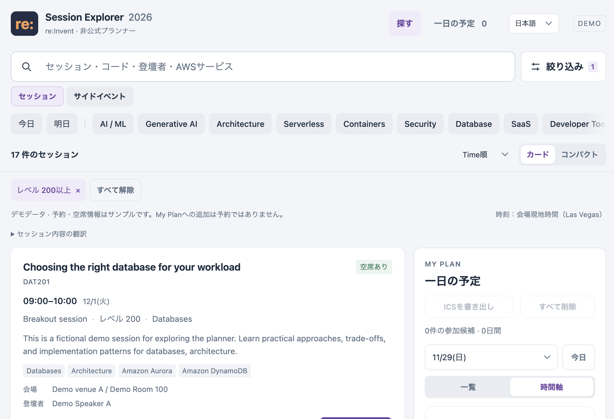

# AWS re:Invent 2026 Session Explorer

AWS re:Invent 2026のセッションを検索し、会場現地時刻で1日の予定を組み立てるMac向けプランナーです。公式カタログの閲覧性を補い、候補の比較、時間の重なり、空き時間を確認できます。

## このアプリの役割

公式カタログやAWS Eventsアプリの代わりではなく、セッション選びと一日の時間調整をしやすくする補助プランナーです。条件を組み合わせた検索、最大3件の比較、Timelineでの重複・空き時間の確認をひと続きに行えます。空き時間に合うセッションもその場で探せます。予約や最新のイベント情報はAWS公式サービスを確認してください。

## Quick Start

### AWS接続（実データ）

AWSの実カタログを使うにはmacOS、Rust、Cargoが必要です。Rustが未導入なら、[Rust公式のインストール案内](https://rust-lang.org/install.html)に従ってrustupを導入してください。rustupはRustとCargoをまとめてインストールします。macOSのターミナルでは次の方法も使えます。

```sh
curl --proto '=https' --tlsv1.2 -sSf https://sh.rustup.rs | sh
```

インストール後にターミナルを開き直し、`rustc --version`と`cargo --version`で確認します。初回ビルドでリンカーやCコンパイラーが見つからない場合は、Xcode Command Line Toolsを追加します。

```sh
xcode-select --install
```

準備できたら、リポジトリのルートで次を実行します。

```sh
./app/reinvent-explorer start
```

ターミナルに表示されたURLをブラウザーで開き、アプリ内の **Builder ID sign-in** を選んでサインインします。終了するときは次を実行します。

```sh
./app/reinvent-explorer stop
```

AWS Events APIから実カタログを取得します。サインインや通信に失敗してもサンプルデータには切り替わりません。AWS接続とプレビューは別の起動方法です。詳しい操作とトラブルシューティングは[アプリ利用ガイド（日本語）](app/README.ja.md)を参照してください。

### プレビュー（サンプルデータ）

認証なしで画面を見たい場合はプレビューを起動してください。Node.jsとpnpmが必要です。AWS Events APIには接続しません。

```sh
pnpm install
pnpm build
pnpm demo
```

ターミナルに表示された `http://127.0.0.1:<port>/` をブラウザーで開きます。終了はターミナルで `Ctrl-C` です。AIに頼むときは、次の文を使えます。

> `QUICKSTART.md`を読んでサンプルデータのプレビューを起動し、URLを教えてください。AWSへのサインインやデータ書き込みは行わないでください。

AIにプレビューを起動してもらう場合の手順は[QUICKSTART.md](QUICKSTART.md)を参照してください。アプリ利用ガイドは[日本語版](app/README.ja.md)と[English](app/README.md)を用意しています。

## 開発時のチェック

JavaScriptはOxlint、CSSはStylelint、Markdownはmarkdownlint-cli2で検査し、OxfmtでJavaScript・CSS・HTML・JSON・Markdownを整形します。RustはrustfmtとClippyを使います。変更ファイルに応じてLefthookがコミット前にチェックし、Push前にテストを実行します。

```sh
pnpm lint
pnpm format
pnpm test
pnpm check
```

Node.jsのパッケージ管理にはpnpmを使います。`pnpm install`で開発ツールとGit hooksを準備してください。

## 画面イメージ



この画像は認証不要のプレビューで、セッション内容はすべて架空データです。AWS接続時には実カタログが表示されます。

## こんな使い方を想定しています

1. AWS Builder IDでサインインし、実際のre:Inventセッションを検索します。
2. レベル、トピック、登壇者、会場、時間などで絞り込み、詳細画面からAWS公式カタログも確認します。
3. 気になるセッションを **My Plan** に追加し、日ごとのTimelineで重複と空き時間を見ながら予定を組みます。AWS接続時は予約済みセッションも起動時に非同期で読み込み、同じTimelineに反映します。
4. 必要なら候補をICSファイルへ書き出し、お使いのカレンダーへ手動で取り込みます。

**My Planへの追加はAWSの予約ではありません。** AWS接続時はMy Planから予約対象を最大10件選び、確認後に一括送信できます。AWS Scheduleから既存予約を最大10件選んで解除することもできます。解除APIは1件ずつ呼び、送信後にScheduleを再読込して個別結果を表示します。受付状況は変わるため、予約前に[AWS公式カタログ](https://catalog.awsevents.com/)で確認してください。実アカウントでの予約・解除フローは未検証です。

## 主な機能

- 実際のAWSセッションカタログをページ末尾まで取得し、タイトル・概要・コード・登壇者・トピックなどを検索
- Level 200以上、日付、時間、形式、会場、Track、Topic、Service、Speakerに加え、Walk-up Only（当日参加のみ）でも絞り込み
- AWS公式のイベント・体験と、出典リンク付きの非公式コミュニティイベントを区別して表示。AWS公式ページの曜日別イベントも掲載
- Card / Compact表示、タイトル・時刻順、最大3件の比較
- My PlanのTimeline / List表示、重複検出、空き時間からのセッション検索
- AWS接続時はScheduleの予約済みセッションを起動時に非同期で読み込み、TimelineとICS書き出しに反映
- AWS公式の注目テーマとAWS公式ブログの最新記事を根拠リンク付きで使い、My Plan候補と重ならないセッションを優先表示
- AWS接続時は興味分野を選んでおすすめを調整。関心設定はブラウザー内に保存
- 対応するデスクトップChromeでは詳細画面から端末内モデルでセッション概要を日本語翻訳
- 詳細画面からAWS公式イベントカタログを開く導線
- 日本語 / EnglishのUI切替
- ICS書き出し（AWS予約済みだけ・Walk-up Onlyだけ・個別選択に対応し、予約状態をラベル表示。カレンダーへの手動取り込み用）
- ローカルstdio MCPサーバー（セッション検索、AWS Schedule読取、重複確認、空き時間に合う候補、Builder IDサインイン開始）
- 対応ブラウザーでは、ページを開いている間だけ利用できるWebMCP試作（My Plan読取・編集など）

## AWS Events APIとMCPの資料

AWS接続アプリはAWS EventsのREST APIを利用します。APIの全体像、サインイン、セッション一覧、参加者スケジュール、予約操作の公式資料はこちらです。

- [AWS Events API 概要](https://docs.aws.amazon.com/events/latest/devguide/what-is-events-api.html)
- [Builder IDサインインとPKCE](https://docs.aws.amazon.com/events/latest/devguide/auth-signing-in.html)
- [セッション一覧（ListSessions）](https://docs.aws.amazon.com/events/latest/devguide/rest-op-listsessions.html)
- [参加者スケジュール（GetSchedule）](https://docs.aws.amazon.com/events/latest/devguide/rest-op-getschedule.html)
- [個人予定の登録](https://docs.aws.amazon.com/events/latest/devguide/rest-op-createpersonaltime.html)・[更新](https://docs.aws.amazon.com/events/latest/devguide/rest-op-updatepersonaltime.html)・[削除](https://docs.aws.amazon.com/events/latest/devguide/rest-op-deletepersonaltime.html)
- [セッション予約（ReserveSessions）](https://docs.aws.amazon.com/events/latest/devguide/rest-op-reservesessions.html)
- [予約取消（CancelReservation）](https://docs.aws.amazon.com/events/latest/devguide/rest-op-cancelreservation.html)
- [AWS公式 Events MCPサーバー](https://docs.aws.amazon.com/events/latest/devguide/mcp-server.html)

AWS接続はREST APIを直接呼び出します。`./app/reinvent-explorer mcp`で起動するローカルstdio MCPサーバーは、セッション検索・AWS Schedule読取・時間重複確認に加え、指定日の空き時間に収まる候補を関心分野・注目テーマ・AWS公式ブログ記事・空席情報で並べます。提案はAWS Scheduleの予約と個人予定を使い、外部カレンダーやブラウザー内ローカル候補は読みません。ChatGPT WebからはOpenAI Secure MCP Tunnel経由で接続できます。セットアップは[アプリガイド](app/README.ja.md)を参照してください。ブラウザー内WebMCPは別機能で、このタブを開いている間だけMy Plan操作を公開します。AWS公式Events MCPサーバーともそれぞれ別の機能です。

## 起動方法とデータ

- **プレビュー（サンプルデータ）**: 架空のセッションで画面を確認できます。AWS Events APIには接続しません。
- **AWS接続（実データ）**: Mac上のRustローカルサーバーがAWS Events APIからカタログを取得します。サインインや通信に失敗しても、サンプルデータへ切り替わることはありません。

AWS接続の手順は[アプリガイド（日本語）](app/README.ja.md)を参照してください。

## データと保存

- AWSアクセストークンはローカルサーバーのメモリに、リフレッシュトークンはmacOS Keychainに置きます。トークンを静的ファイルやブラウザーのLocal Planへ保存しません。
- AWSカタログのキャッシュはMac内のApplication Supportにアカウント別で保存されます。
- My Planの手動候補はブラウザーの`localStorage`にAWSアカウントとイベントごとに分けて保存されます。AWS接続時はScheduleの予約済みセッションと個人予定を非同期で同じ予定表に統合し、お気に入りは専用タブから選べます。セッション単体のお気に入り登録・解除と、My Planから最大10件の一括登録に対応します。お気に入りは予約ではなく、関心を記録します。個人予定やお気に入りの変更はAWS Scheduleを再読込して照合します。ICS出力画面ではMy Plan候補、AWS予約、お気に入り、個人予定から対象を選べ、「AWS予約済みだけ」「Walk-up Onlyだけ」の一括選択と個別選択ができます。予約状態とWalk-up Onlyはイベント名に表示します。予約情報をAWSへ書き込む操作は明示確認が必要です。
- My Planは同じブラウザープロファイル・同じlocalhost originで再利用できます。ブラウザーデータを消去した場合や、localhostのポートが変わった場合は別の保存領域になり、他のブラウザーやMacへも自動移行しません。

## 現在の制約

- AWS一括予約はAWS接続時に確認後、最大10件を送信し、Schedule再読込と個別結果表示を行います。既存予約の解除も可能ですが、AWS Scheduleに載っている項目だけが対象で、取消APIは1件ずつ呼び出します。予約済み項目はMy Planに取り込み表示しますが、AWS予約とローカル候補の状態は別管理です。
- AWSお気に入りは単体またはMy Planから最大10件を登録し、Scheduleを再読込して結果を確認します。AWSの応答が不明な場合は安全のため自動再送せず、Scheduleで確認してください。AWSお気に入り書き込みは実アカウントで未検証です。
- MCPは読み取り専用で、セッション検索・Schedule読取・重複確認・空き時間提案を提供し、予約や取消はできません。ローカルstdio接続に対応したクライアント、またはSecure MCP Tunnel設定後のChatGPT Webから利用できます。
- [AWS公式のre:Invent体験ページ](https://aws.amazon.com/jp/events/reinvent/experiences/uniquely-reinvent/)にある曜日別イベント・会場内体験と、[Conference Partiesのre:Invent 2026一覧](https://conferenceparties.com/reinvent2026/)に掲載されたコミュニティイベントを区別して掲載します。Conference PartiesはAWS非公式で、AWSとは提携・承認関係にありません。時刻が公式ページにない場合は未確認として表示し、第三者一覧の時刻にはその出典リンクを付けます。参加条件・会場・受付状況は変わる場合があるため、参加前に各イベントの主催者情報を確認してください。

## ライセンス

ソースコードは[MIT License](LICENSE)で公開します。AWSの商標やAWS Eventsから取得するイベント情報には、それぞれの権利者・利用条件が適用されます。
